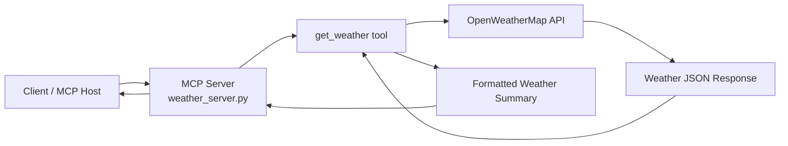

# Weather MCP Server

A minimal Model Context Protocol (MCP) server that exposes a weather tool powered by OpenWeatherMap.

## Overview

This project provides an MCP server with a single tool:

- `get_weather(city: str, country: str = "") -> str`

It fetches current weather information for a city and returns a short summary string.

## Architecture



## Prerequisites

Before running this server, make sure you have:

- Python 3.10+
- A virtual environment
- An OpenWeatherMap API key
- The `mcp` CLI available in the environment

## Project Structure

```text
weather-mcp-server/
├── weather_server.py
├── .venv/
├── README.md
└── ...
```

## Setup

1. Clone or open this project directory.
2. Create and activate a virtual environment.

### Linux / macOS

```bash
python -m venv .venv
source .venv/bin/activate
```

### Windows (PowerShell)

```powershell
python -m venv .venv
.\.venv\Scripts\Activate.ps1
```

### Windows (Command Prompt)

```cmd
python -m venv .venv
.\.venv\Scripts\activate.bat
```

3. Install dependencies if needed:

```bash
pip install -r requirements.txt
```

If there is no `requirements.txt`, install the required packages manually:

```bash
pip install httpx mcp fastmcp
```

4. Set your OpenWeatherMap API key.

### Linux / macOS

```bash
export OPENWEATHER_API_KEY="YOUR_API_KEY_HERE"
```

### Windows (PowerShell)

```powershell
$env:OPENWEATHER_API_KEY="YOUR_API_KEY_HERE"
```

### Windows (Command Prompt)

```cmd
set OPENWEATHER_API_KEY=YOUR_API_KEY_HERE
```

## Running the Server

Start the MCP server with:

### Linux / macOS

```bash
source .venv/bin/activate
mcp run weather_server.py
```

### Windows (PowerShell)

```powershell
.\.venv\Scripts\Activate.ps1
mcp run weather_server.py
```

### Windows (Command Prompt)

```cmd
.\.venv\Scripts\activate.bat
mcp run weather_server.py
```

## Tool Usage

The server exposes a tool named `get_weather`.

### Example

```python
await get_weather(city="London", country="GB")
```

### Example output

```text
The current weather in London is broken clouds with a temperature of 18.2°C.
```

## Configuration Placeholders

Use these placeholders when customizing the project:

- `YOUR_API_KEY_HERE` → OpenWeatherMap API key
- `YOUR_PROJECT_NAME` → human-readable project title
- `YOUR_USERNAME_OR_ORG` → GitHub owner or org name
- `YOUR_REPO_NAME` → repository name
- `YOUR_HOST` → server hostname or deployment target
- `YOUR_PORT` → service port if exposed through HTTP

## Environment Variables

| Variable | Required | Description |
|---|---:|---|
| `OPENWEATHER_API_KEY` | Yes | API key used to authenticate requests to OpenWeatherMap |

## Notes

- This implementation currently calls the OpenWeatherMap API over HTTPS.
- The response is returned as a simple string message suitable for MCP clients.
- The server is intended to be used through the MCP runtime, not as a standalone web app.

## Common Troubleshooting

### API key is missing

You may see:

```text
Error: OPENWEATHER_API_KEY is not set. Please set it as an environment variable.
```

Fix by exporting the key before starting the server.

### MCP runtime compatibility

If the server does not load correctly with your installed version of the MCP package, ensure the project uses a compatible API. In this repo, the current setup uses the `MCPServer` object from the installed MCP SDK.

## License

Add your license here, for example:

```text
MIT
```

## Contributing

Add contribution instructions here, such as:

- Fork the repo
- Create a feature branch
- Commit changes
- Open a pull request

## Contact

Replace this section with your contact or maintainer details.

```text
Maintainer: YOUR_NAME
Email: YOUR_EMAIL@example.com
```
